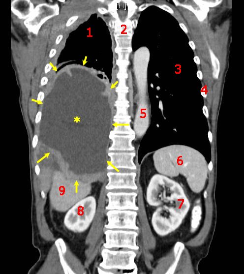

# Exersice1-Demo-STA426
## Cancer

## Definitions

Cancers are a large family of diseases that involve abnormal [cell growth](https://en.wikipedia.org/wiki/Cell_growth) with the potential to invade or spread to other parts of the body. They form a subset of [neoplasms](https://en.wikipedia.org/wiki/Neoplasm). A neoplasm or tumor is a group of cells that have undergone unregulated growth and will often form a mass or lump, but may be distributed diffusely.

All tumor cells show the [six hallmarks of cancer](https://en.wikipedia.org/wiki/The_Hallmarks_of_Cancer). These characteristics are required to produce a malignant tumor. They include:

* Cell growth and division absent the proper signals
* Continuous growth and division even given contrary signals
* Avoidance of programmed cell death
* Limitless number of cell divisions
* Promoting blood vessel construction
* Invasion of tissue and formation of metastases

The progression from normal cells to cells that can form a detectable mass to outright cancer involves multiple steps known as malignant progression.

## Causes

The majority of cancers, some **_90–95%_** of cases, are due to genetic mutations from environmental and lifestyle factors. The remaining 5–10% are due to [inherited genetics](https://en.wikipedia.org/wiki/Heredity).

Common environmental factors that contribute to cancer death include tobacco (**_25–30%_**), diet and [obesity](https://en.wikipedia.org/wiki/Obesity) (**_30–35%_**), infections (**_15–20%_**), [radiation](https://en.wikipedia.org/wiki/Radiation) (both ionizing and non-ionizing, up to **_10%_**), stress, lack of [physical activity](https://en.wikipedia.org/wiki/Exercise) and pollution.

1. Chemicals
2. Diet and exercise
3. Infection
4. Radiation
5. Heredity
6. Physical agents
7. Hormones
8. Autoimmune diseases

## Carcinogenesis

Carcinogenesis, also called **oncogenesis** or **tumorigenesis**, is the formation of a cancer, whereby normal [cells](https://en.wikipedia.org/wiki/Cell_(biology)) are [transformed](https://en.wikipedia.org/wiki/Malignant_transformation) into cancer cells. The process is characterized by changes at the cellular, genetic, and [epigenetic][epigenetics] levels and abnormal [cell division](https://en.wikipedia.org/wiki/Cell_division). Cell division is a physiological process that occurs in almost all [tissues](https://en.wikipedia.org/wiki/Tissue_(biology)) and under a variety of circumstances. Normally the balance between proliferation and programmed cell death, in the form of [apoptosis](https://en.wikipedia.org/wiki/Apoptosis), is maintained to ensure the integrity of tissues and [organs](https://en.wikipedia.org/wiki/Organ_(anatomy)). According to the prevailing accepted theory of carcinogenesis, the somatic mutation theory, [mutations](https://en.wikipedia.org/wiki/Mutation) in DNA and [epimutations][epigenetics] that lead to cancer disrupt these orderly processes by disrupting the programming regulating the processes, upsetting the normal balance between proliferation and cell death. This results in uncontrolled cell division and the [evolution of those cells](https://en.wikipedia.org/wiki/Somatic_evolution_in_cancer) by [natural selection](https://en.wikipedia.org/wiki/Natural_selection) in the body. Only certain mutations lead to cancer whereas the majority of mutations do not.

[epigenetics]: https://en.wikipedia.org/wiki/Epigenetics

## Metastasis

[Metastasis](https://en.wikipedia.org/wiki/Metastasis) is the spread of cancer to other locations in the body. The dispersed tumors are called metastatic tumors, while the original is called the primary tumor. Almost all cancers can metastasize. Most cancer deaths are due to cancer that has metastasized.

Metastasis is common in the late stages of cancer and it can occur via the blood or the [lymphatic system](https://en.wikipedia.org/wiki/Lymphatic_system) or both. The typical steps in metastasis are local [invasion](https://en.wikipedia.org/wiki/Invasion_(cancer)), [intravasation](https://en.wikipedia.org/wiki/Invasion_(cancer)) to the blood or lymph, circulation through the body, [extravasation](https://en.wikipedia.org/wiki/Extravasation) into the new tissue, proliferation and [angiogenesis](https://en.wikipedia.org/wiki/Angiogenesis). Different types of cancers tend to metastasize to particular organs, but overall the most common places for metastases to occur are the lungs, liver, brain and the bones.

## Diagnosis

Most cancers are initially recognized either because of the appearance of signs or symptoms or through [screening](https://en.wikipedia.org/wiki/Cancer_screening).  People with suspected cancer are investigated with [medical tests](https://en.wikipedia.org/wiki/Medical_test). These commonly include [blood tests](https://en.wikipedia.org/wiki/Blood_test), [X-rays](https://en.wikipedia.org/wiki/Projectional_radiography), (contrast) [CT scans](https://en.wikipedia.org/wiki/CT_scan) and [endoscopy](https://en.wikipedia.org/wiki/Endoscopy).

[Cytogenetics](https://en.wikipedia.org/wiki/Cytogenetics) and [immunohistochemistry](https://en.wikipedia.org/wiki/Immunohistochemistry) are other types of tissue tests. 

## Classification

Cancers are classified by the type of cell that the tumor cells resemble and is therefore presumed to be the origin of the tumor. These types include:

* [Carcinoma](https://en.wikipedia.org/wiki/Carcinoma)
* [Sarcoma](https://en.wikipedia.org/wiki/Sarcoma)
* [Lymphoma](https://en.wikipedia.org/wiki/Lymphoma) and [leukemia](https://en.wikipedia.org/wiki/Leukemia)
* [Germ cell tumor](https://en.wikipedia.org/wiki/Germ_cell_tumor)
* [Blastoma](https://en.wikipedia.org/wiki/Blastoma)

## Prevention

Cancer prevention is defined as active measures to decrease cancer risk. The vast majority of cancer cases are due to environmental risk factors. Many of these environmental factors are controllable lifestyle choices. Thus, cancer is generally preventable. Between **_70%_** and **_90%_** of common cancers are due to environmental factors and therefore potentially preventable.

1. Dietary  
2. Medication
3. Vaccination  

>“Cancer can touch you, but not your soul; neither your thoughts, nor your heart. Faith is the strength by which a shattered world shall emerge into the light."

Sources : 

https://en.wikipedia.org/wiki/Cancer

https://en.wikipedia.org/wiki/Carcinogenesis

